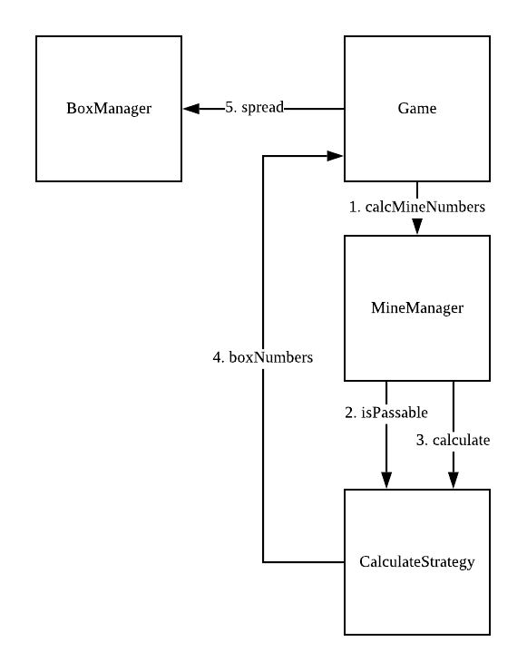

# 지뢰찾기

* 사각형은 가로 10줄, 세로 10줄
* 지뢰는 10개이며 랜덤
* 각 사각형에 표시될 숫자는, 자신을 제외한 주변 8개 사각형에 포함된 폭탄의 갯수
* 모든 사각형(100개)에 대한 숫자를 구해야함 (지뢰를 별도 flag로 표기 X)

## 개발 환경
* java 1.8
* Intellij 2020.1
* gradle 6.1.1

## 빌드 & 실행
1. `./gradlew clean build`
2. `java -jar build/libs/MineSweeper-1.0-SNAPSHOT.jar`

## 전체적인 흐름

1. Game 객체에서 MineManager에게 카운트값을 증가시킬 박스 인덱스를 구하도록 명령
2. MineManager 는 Game 객체 생성자로 주입받은 지뢰 인덱스에 대해 '해당 전략으로 이동이 가능한지' 를 만족하는 전략들을 필터링한다.
3. 필터링된 전략을 돌면서 증가시킬 박스 인덱스를 구한다.
4. Game 객체는 구한 박스 인덱스들을 BoxManager에게 넘겨서 실제로 박스들의 카운트 값을 증가시킨다.